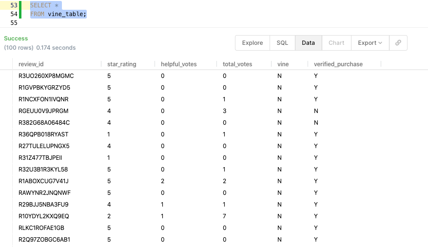
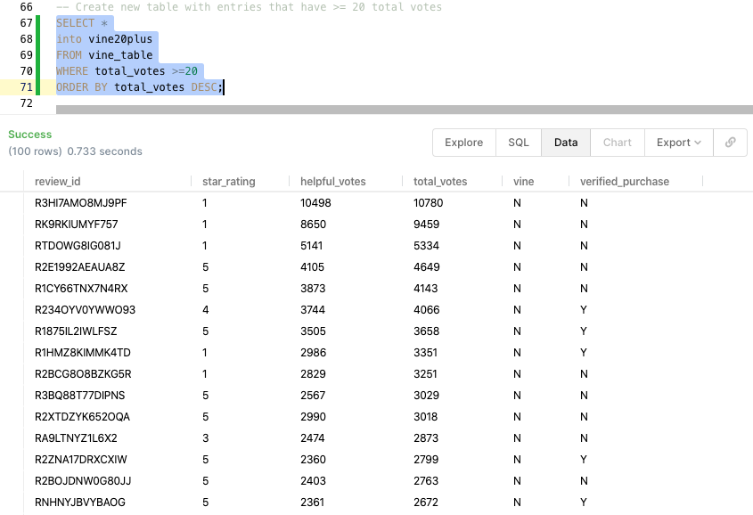
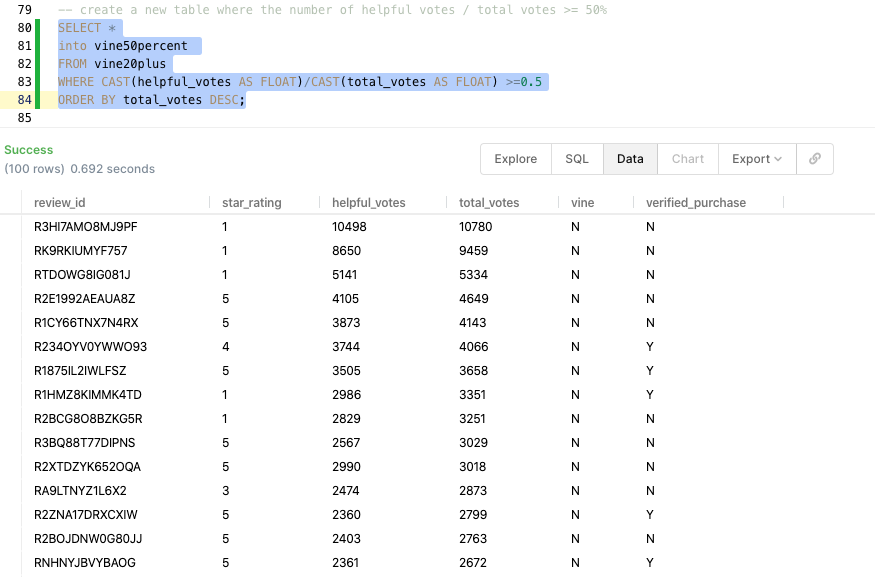
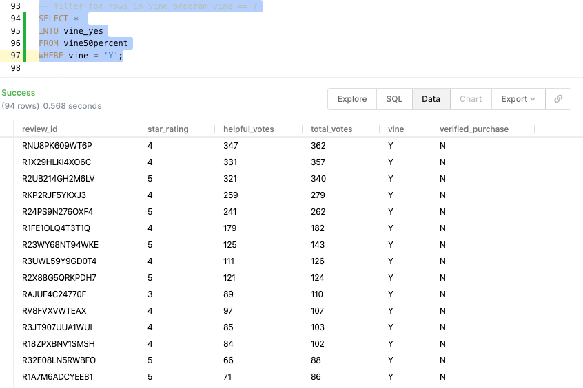
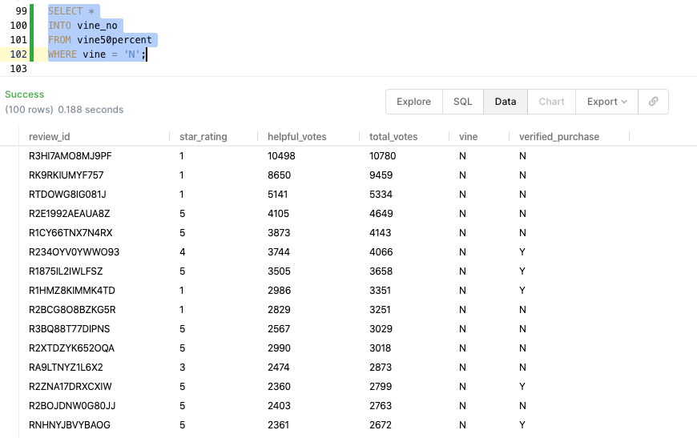
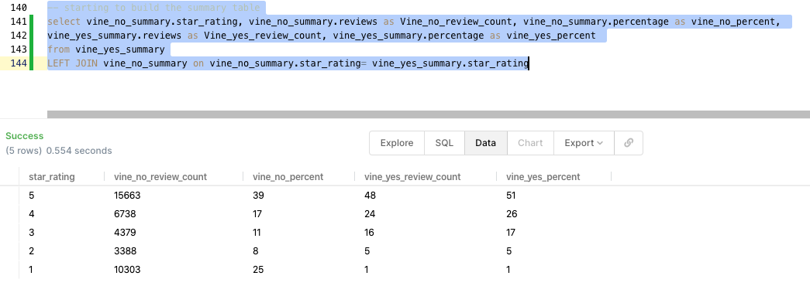

# Amazon_Vine_Analysis

*****
*****

* By: Tyler Sojka
* December 2020
* Big Data: Using Amazon Web Services to create a postgreSql database via the Amazon Relational Database Service (RDS). Using Spark to connect to the DB, and SQL to analyze the data.
  
*****
*****

## Tools

* Amazon Web Services (AWS)
 * Amazon Web Services is a subsidiary of Amazon providing on-demand cloud computing platforms and APIs to individuals, companies, and governments, on a metered pay-as-you-go basis.
* Amazon Relational Database Service (RDS)
  * Amazon Relational Database Service (Amazon RDS) makes it easy to set up, operate, and scale a relational database in the cloud. It provides cost-efficient and resizable capacity while automating time-consuming administration tasks such as hardware provisioning, database setup, patching and backups.
* Google Colab
  * Colaboratory, or “Colab” for short, is a product from Google Research. Colab allows anybody to write and execute arbitrary python code through the browser, and is especially well suited to machine learning, data analysis and education.
* Spark
    * Apache Spark is an open-source distributed general-purpose cluster-computing framework. Spark provides an interface for programming entire clusters with implicit data parallelism and fault tolerance.
* pgAdmin 
  * pgAdmin is the most popular and feature rich Open Source administration and development platform for PostgreSQL, the most advanced Open Source database in the world.
* PostgreSQL
  * PostgreSQL is a powerful, open source object-relational database system with over 30 years of active development that has earned it a strong reputation for reliability, feature robustness, and performance.
* PopSQL
  * PopSQL is a modern SQL editor for teams. It lets you write queries, organize them in folders, visualize your data, and collaborate with your team.
* Amazon S3
  * Amazon S3 or Amazon Simple Storage Service is a service offered by Amazon Web Services that provides object storage through a web service interface. Amazon S3 uses the same scalable storage infrastructure that Amazon.com uses to run its global e-commerce network.

## Overview

The purpose of this analysis is to analyze a set of Amazon product reviews, to see if there is any bias towards favorable reviews from Vine members. The Amazon vine program is an invite only program where Amazon invites the most trusted reviewers on Amazon to post opinions about new and pre-release items to help their fellow customers make informed purchase decisions. Amazon invites customers to become Vine Voices based on their reviewer rank, which is a reflection of the quality and helpfulness of their reviews as judged by other Amazon customers. Amazon provides Vine members with free products that have been submitted to the program by participating vendors. Vine reviews are the independent opinions of the Vine Voices. The vendor cannot influence, modify or edit the reviews. Amazon does not modify or edit Vine reviews, as long as they comply with our posting guidelines. A Vine review is identified with the green stripe Customer review from the Amazon Vine Program. 

## Results

For my analysis I chose to analyze the video game dataset supplied by Amazon at [Sample Amazon Datasets](https://s3.amazonaws.com/amazon-reviews-pds/tsv/index.txt)

The dataset was loaded into a postgreSQL database for further cleaning.

The first step was to filter for products that recieved 20+ reviews:

and of those products, only those with a 50% or more useful review to total reviews were selected. 

The filtered results were then broken into two catagories, those that were a part of the vine program, and those that were not.

These were then transformed to return the number of reviews, percent of the total for each category, and grouped by star rating

The two categorical vine tables were then joined on star rating and combined into one summary table to create a high level overview of the data:

* Vine review count: 94
* Non vine review count: 40,471
* Vine 5 star review count: 48
* Non vine 5 star review count: 15,663
* Vine 5 star percent: 51%
* Non vine 5 star percent: 39%

## Summary

Positive bias refers to the human tendency to overestimate the possibility of positive (good) things happening in life or in research. In publication, it is the preference for publishing research that has a positive (eventful) outcome, than an uneventful or negative outcome. Our analysis was to determine if there is a positive bias for reviews in the vine program, and the conclusion is, slightly. In addition, there are 9% more vine program 4 star reviews. I would say that  10% more 5 star reviews coming from the vine program is not enough to say there is a positive bias. The more concerning aspect that may lead to one thinking there is a positive bias is the fact that the people are given the products to review for free, and are chosen from a select few people. 

An additional analysis that could be done would be to see how the review percentages vary from all of the different data sets. This would give a better understanding of the overall vine program, not just this subset of video game reviews.